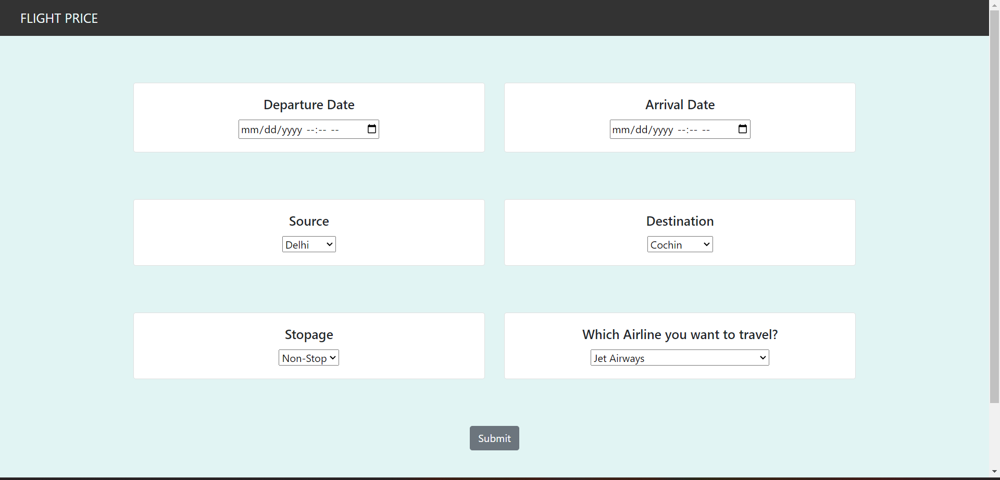

# Flight Fare Prediction: 

In this data science project, the goal is to develop a machine learning model using Machine Learning to predict flight prices. The project aims to help travelers make informed decisions by providing accurate and reliable price estimates for their desired flights.

The project involves collecting a comprehensive dataset that includes relevant features such as departure and arrival locations, dates, airlines, and other factors that influence flight prices. The dataset is preprocessed to handle missing values, perform feature engineering, and ensure data quality.

Using Python programming language and the Random Forest algorithm, a predictive model is trained on the dataset. The model leverages the ensemble learning technique to handle complex relationships between features and predict flight prices with high accuracy. Model performance is evaluated using appropriate evaluation metrics and cross-validation techniques.

The project also involves data visualization techniques to gain insights into the factors affecting flight prices. Exploratory data analysis and feature importance analysis are performed to understand the relative impact of different features on the final predictions.

Throughout the project, a strong emphasis is placed on data preprocessing, model selection, hyperparameter tuning, and model evaluation to ensure the best possible accuracy in flight price predictions. The final trained model is then deployed, allowing users to input flight details and obtain estimated prices for their desired flights.

By successfully completing this project, we can provide travelers with a reliable tool for estimating flight prices, empowering them to make informed decisions and potentially save money on their travel expenses.


## Directory Tree 
```
├── static 
│   ├── css
├── template
│   ├── home.html
├── Procfile
├── README.md
├── app.py
├── flight_price.ipynb
├── flight_rf.pkl
├── requirements.txt
```

## Technologies Used

Pandas 
Numpy 
Scikit-Learn
Matolotlib
Jupter notedbook
HTML , CSS for UI
Render for deploying 
GITHUB and Git


## Future Scope

* Use multiple Algorithms
* Optimize Flask app.py
* Front-End 
